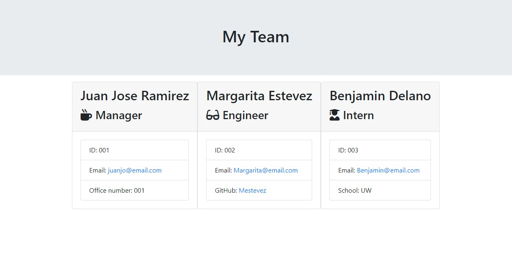

# Team profile generator 

## Description
    
This code completes an HTML file using information granted by command line using ```inquirer```, a helpful ```npm package``` that runs in ```Nodejs```.  It allows to build a development team, using ES6 ```classes```, in this case there is base class called ```Employee```, and three classes extends from it, ```Manager```, ```Engineer``` and ```Intern```, all with diferents attributes and methods.

## Table of content
* [Description](#description)
* [Instalation](#installation)
* [Usage Information](#usage-information)
* [Questions](#questions)


## Installation

To run this project, install it locally using npm:
```
npm i
```

## Usage Information
    
Install npm dependencies, then run using ```Node.js``` the file ```index.js```.    


## Working Code



## Questions
    
[Juan Jose Ramirez Github profile](https://github.com/JuanjoRamirez262)

email: juanjoramirezps@gmail.com

